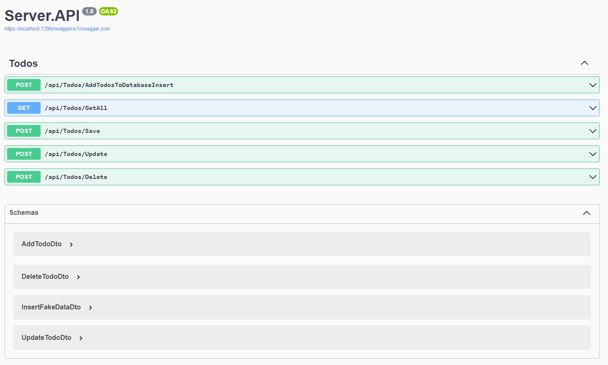

# WebApi ve Node.js ile To-Do Uygulaması

Bu proje, .NET 8 WebApi ve Node.js kullanılarak geliştirilmiş bir To-Do (Görev) uygulamasını içermektedir. Projede ayrıca MongoDB kullanılmıştır ve Frontend kısmında JavaScript ile bir arayüz oluşturulmuştur.



## Projeyi Çalıştırma

Proje, iki farklı backend içermektedir: .NET WebApi (C#) ve JavaScript (Node.js) backend. Her iki backend'i de başlatmak için aşağıdaki adımları takip edebilirsiniz.

### .NET WebApi (C#) Backend

1. `WebApi` klasörüne gidin.

    ```bash
    cd Server
    ```

2. Gerekli paketleri yüklemek için aşağıdaki komutu çalıştırın.

    ```bash
    dotnet restore
    ```

3. MongoDB bağlantı bilgilerinizi `TodosController.cs` dosyasında güncelleyin.

4. WebApi'yi başlatmak için aşağıdaki komutu çalıştırın.

    ```bash
    dotnet run
    ```

    WebApi, varsayılan olarak `https://localhost:5001` adresinde çalışacaktır.

### JavaScript (Node.js) Backend

1. `Client` klasörüne gidin.

    ```bash
    cd Client
    ```

2. Gerekli paketleri yüklemek için aşağıdaki komutu çalıştırın.

    ```bash
    npm install
    ```

3. MongoDB bağlantı bilgilerinizi `api.js` dosyasında güncelleyin.

4. JavaScript backend'i başlatmak için aşağıdaki komutu çalıştırın. | yada

    ```bash
    npm start
    ```
     ```bash
    nodemon .api.js
    ```

    JavaScript backend, varsayılan olarak `http://localhost:7000` adresinde çalışacaktır.

### Frontend (Bootstrap, JavaScript)

1. `Client` klasörüne gidin.

    ```bash
    cd Client
    ```

2. Gerekli paketleri yüklemek için aşağıdaki komutu çalıştırın.

    ```bash
    npm install
    ```

3. Frontend'i başlatmak için aşağıdaki komutu çalıştırın.

    ```bash
    npm start
    ```

    Frontend, varsayılan olarak `http://127.0.0.1:5500/` adresinde çalışacaktır.

## Kullanılan Kütüphaneler

- **.NET WebApi (C#) Backend**
  - `Microsoft.AspNetCore` - ASP.NET Core framework'ü.
  - `MongoDB.Driver` - MongoDB ile etkileşim sağlayan sürücü.
  - `Bogus` - Fake veri oluşturmak için kullanılan kütüphane.

- **JavaScript (Node.js) Backend**
  - `express` - Web uygulamaları oluşturmak için kullanılan hafif bir framework.
  - `mongoose` - MongoDB ile etkileşim sağlayan ODM (Object Data Modeling) kütüphanesi.
  - `cors` - Cross-Origin Resource Sharing (CORS) desteği sağlayan middleware.
  - `nodemon` - Geliştirme sırasında otomatik olarak sunucuyu yeniden başlatan bir araç.

- **Frontend (Node.js)**
  - `JavaScript` - HTTP istekleri yapmak için kullanılan bir kütüphane.
  - `bootstrap` - UI tasarımı için popüler bir CSS framework'ü.

## Fake Veri Eklemek

Proje, fake veri eklemek için `Bogus` kütüphanesini kullanmaktadır. `Server/TodosController.cs` dosyasını inceleyerek ve gerekirse güncelleyerek fake veri ekleyebilirsiniz.

## Hatalar ve Güncellemeler

Proje üzerinde bazı hatalar olabilir. Güncelleme ve düzeltmeler için repo düzenli olarak güncellenmektedir.

## Katkıda Bulunma

Herhangi bir hata bulursanız veya katkıda bulunmak istiyorsanız, lütfen bir "issue" açın veya bir "pull request" gönderin. Katkılarınızı bekliyoruz!

---

**Uygulama İlgili Linkler:**
- [GitHub Repo](https://github.com/nLabsGlobalTechnologgies/WebApiAndNodeJsAndFrontendJavascriptTodoApp)
- [MongoDB](https://www.mongodb.com/)
- [Bogus](https://github.com/bchavez/Bogus)
